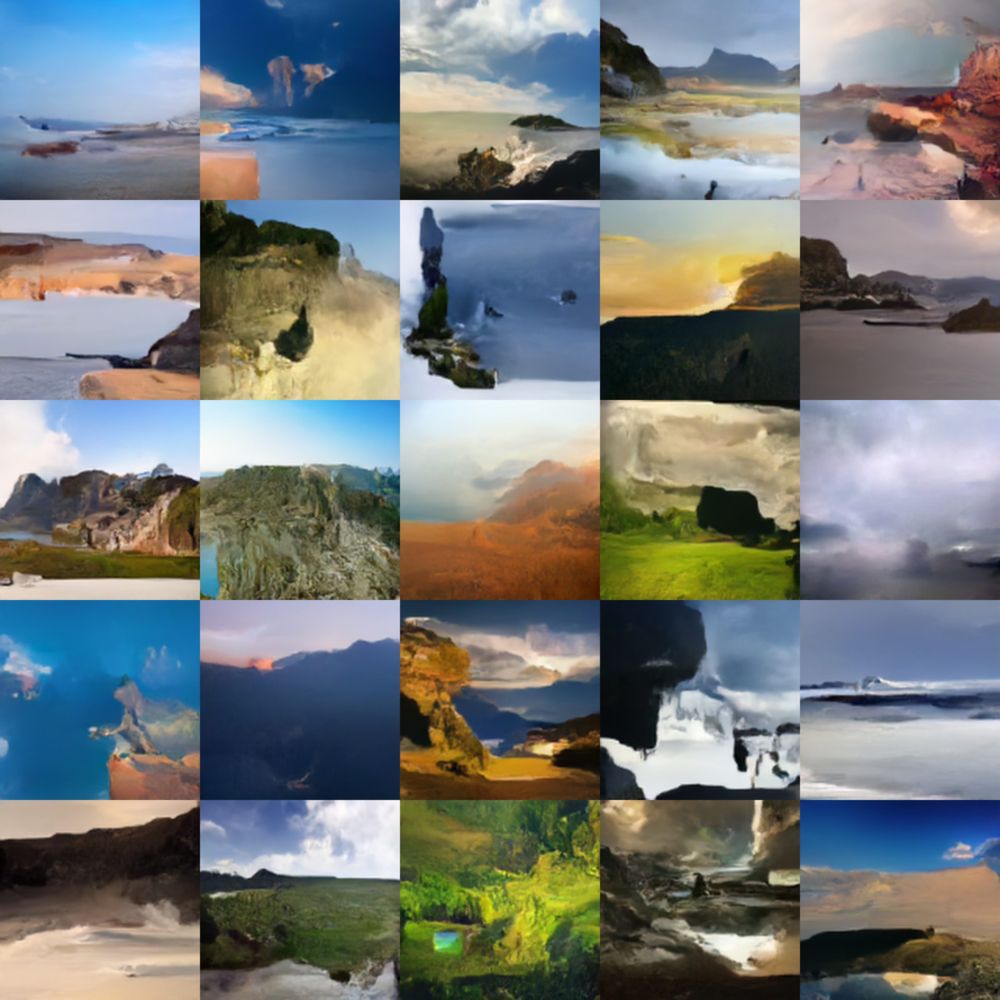

# Denoising-Diffusion-Toy-Implementation
An implementation of DDM to play with.

Diffusion proces taken from [here](https://colab.research.google.com/drive/1sjy9odlSSy0RBVgMTgP7s99NXsqglsUL?usp=sharing).

Model is a UNet (OtherModel.py) with attention. Can't remember from where but pretty sure it was from [here](https://github.com/LeeJunHyun/Image_Segmentation).

# Resulsts on FFHQ

# Resulsts on Landscapes

# TO-DO
Image interpolation via reversing the ODE in the forward direction.
